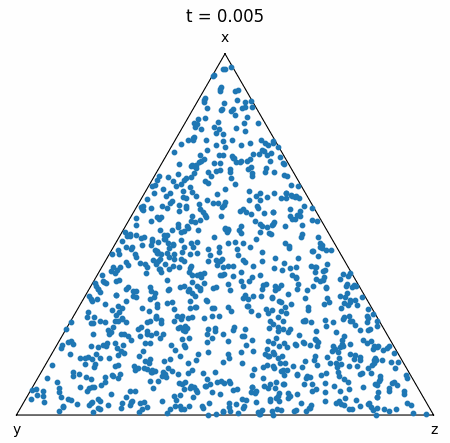
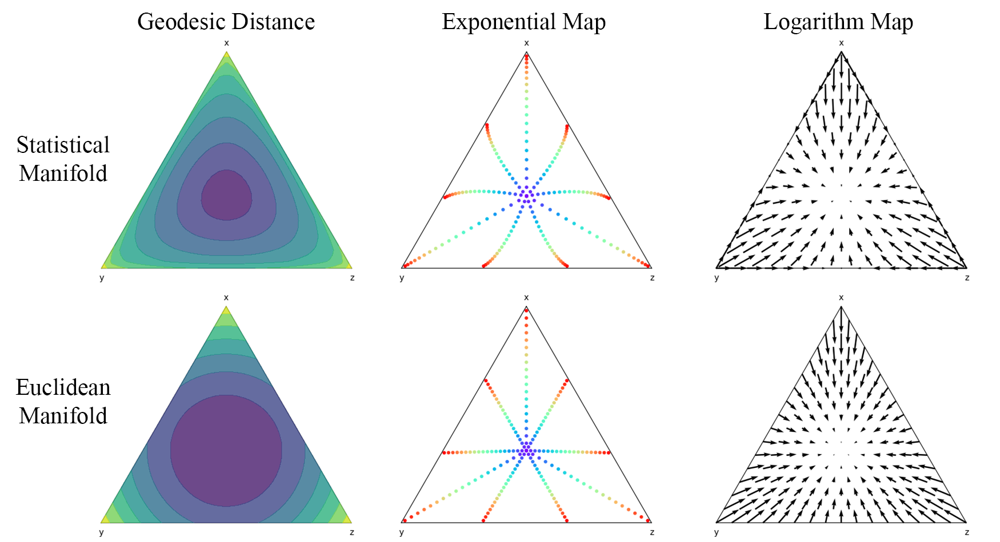

# Statistical Flow Matching (SFM)

By Chaoran Cheng, Oct 2nd, 2024

This is the official repo for the NeurIPS 2024 paper *Categorical Flow Matching on Statistical Manifolds* by Chaoran Cheng, Jiahan Li, Jian Peng, and Ge Liu. The paper is available at [arXiv](https://arxiv.org/abs/2405.16441).




## Introduction

We introduce *statistical flow matching* (SFM) as a novel discrete generative framework on the manifold of parameterized probability measures inspired by information geometry. Using the Fisher-Rao metric, we obtain the intrinsic Riemannian geometry of the statistical manifold and propose a numerically stable FM algorithm on categorical data with a diffeomorphism. SFM enjoys multiple advantages thanks to its continuous and geometric formulation. Check out our paper for more details!



## Installation

#### Stand-alone installation
Want to incorporate SFM into your own project? Simply copy `models/categorical.py` into your project and import it as a module:
```python
import torch.nn as nn
from models.categorical import SphereCategoricalFlow


class DummyVF(nn.Module):
    def __init__(self, n_class=2, hidden_dim=128):
        super().__init__()
        self.fc = nn.Sequential(
            nn.Linear(n_class, hidden_dim),
            nn.ReLU(),
            nn.Linear(hidden_dim, n_class)
        )

    def forward(self, x, t):
        return self.fc(x)


sfm = SphereCategoricalFlow(
    DummyVF(2, 128), data_dims=2, n_class=2, ot=False
)
```

The vector field encoder should be an `nn.Module` instance that accepts the current noised data `x`, timestep `t`, and any (optional) additional conditional arguments as input. See [Usage](#usage) for more details. Below are the requirements (you've probably already had them!):

- `1.10 <= torch <= 1.13` OR `torch >= 2.0` (recommended). For `torch <= 1.3`, the package `functorch` is used. Note that in some early versions, `functorch` is not automatically installed with PyTorch, and you may need to install it manually. For `torch >= 2.0`, `torch.func` is now shipped with PyTorch.
- `torchdiffeq, tqdm, numpy`.
- `scipy` (optional). Only required for the optimal transport during training with `ot=True`.


#### Base installation
With this installation, you can run all the experiments in the paper except for the promoter design task and pytorch-lightning training script. `jupyter` is not included in the environment.
```bash
conda env create -f env_base.yml
```

#### Pytorch-lightning installation (optional)
With this installation, you can use pytorch-lightning with multi-GPU training (on Text8) in addition to all the experiments in the base environment. `torch >= 2.0` is required to run the nanoGPT with Flash Attention. `jupyter` is not included in the environment.
```bash
conda env create -f env_lightning.yml
```

#### Promoter design task (optional)
To run the promoter design experiments, first download the datasets and the pre-trained Sei model [here](https://doi.org/10.5281/zenodo.7943307) and put them under `data/promoter` (some extraction may be needed). Then install the additional dependencies:
```bash
pip install pytabix pyBigWig pyfaidx pandas
```


## Usage

Our implementation is designed to be flexible and easy to use. As demonstrated [above](#stand-alone-installation), you can easily incorporate SFM into your own project by defining a vector field encoder. An arbitrary number of conditional arguments can also be passed to the encoder. Below we document the main methods of the SFM class.

- Manifold operations
  - `dist(cls, p, q, eps=0.)` Calculate the geodesic distance $d_g(p,q)$ between two points on the manifold.
  - `exp(cls, p, u, eps=0.)` Calculate the exponential map $\exp_p(u)$.
  - `log(cls, p, q, eps=0.)` Calculate the logarithmic map $\log_p(q)$.
  - `interpolate(cls, p, q, t, eps=0.)` Calculate the interpolant between two points.
  - `vecfield(cls, p, q, t, eps=0.)` Calculate the interpolant and the vector field.
- Model operations
  - `forward(self, t, pt, *cond_args)` Forward pass of the model for predicting the vector field. The conditional arguments are assumed to have the first dimension as the batch dimension.
  - `get_loss(self, p, *cond_args)` Calculate the loss of the model given the target data.
- Sampling & NLL functions
  - `sample(self, method, n_sample, n_steps, device, *cond_args, return_traj=False)` Sample from the model using different methods.
  - `compute_nll(self, method, p1, n_steps=200, tmax=1., tmin=0., exact=False, verbose=False)` Calculate the NLL of given data.
  - `compute_elbo(self, method, p1, n_steps=200, tmax=0.995, verbose=False)` Calculate the ELBO for NLL of given one-hot data.

We also provide an implementation for the naive SFM that directly learns the vector field without the diffeomorphism in `SimpleCategoricalFlow` and a linear flow matching model that assumes a flat Euclidean geometry of the simplex in `LinearCategoricalFlow`. The interfaces are identical to `SphereCategoricalFlow`. More concrete examples can be found in [Notebook](#notebook).

To train the model with the provided training script, you can use the following command:
```bash
python main.py configs/bmnist.yaml --savename bmnist
```
Most arguments in the config file are self-explanatory. Feel free to modify them to suit your needs.
To train the model using multiple GPUs, make sure you have pytorch-lightning properly installed following the instructions above, and run the following command:

```bash
python main_lightning.py configs/text8_lightning.yaml --savename text8_lightning
```


## Notebook

We provide several notebooks to demonstrate the usage of SFM on different datasets. To run these notebooks, make sure Jupyter Notebook or JupyterLab is properly installed. Also, install `plotly` for interactive plots using `pip install plotly`.

#### `vis_simplex.ipynb`
This notebook provides the visualization of the Riemannian structure and the Euclidean structure of the probability simplex. Geodesic distances, exponential maps (geodesics), and logarithm maps (vector fields) are plotted.

#### `swissroll.ipynb`
In this notebook, we train SFM and LinearFM on the Swiss roll on simplex dataset and calculate the NLL of the training samples.

#### `eval_bmnist.ipynb`
In this notebook, we evaluate the pre-trained SFM on the binary MNIST dataset. We calculate the FID of the generated samples and the NLL of the test data.


## Reference

if you find this repo useful, please consider citing our paper:
```bibtex
@inproceedings{cheng2024categorical,
  title={Categorical Flow Matching on Statistical Manifolds},
  author={Cheng, Chaoran and Li, Jiahan and Peng, Jian and Liu, Ge},
  booktitle={Annual Conference on Neural Information Processing Systems 2024, NeurIPS 2024, Vancouver, BC, Canada, December 10 - 15, 2024},
  year={2024},
}
```